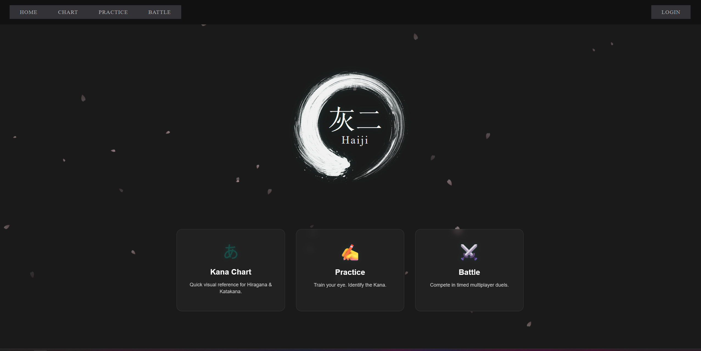
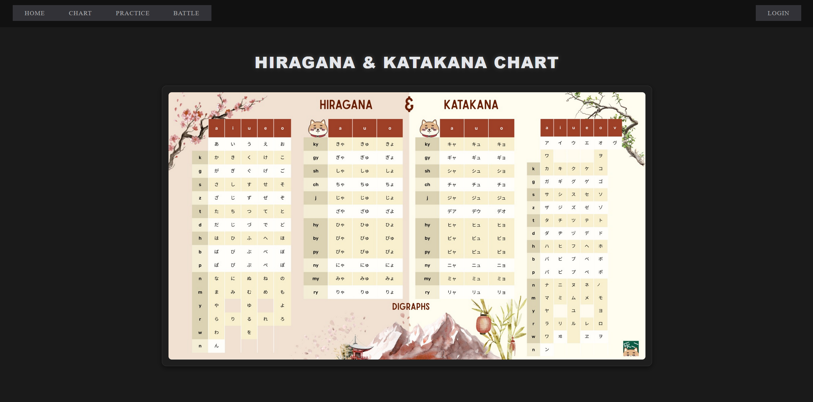
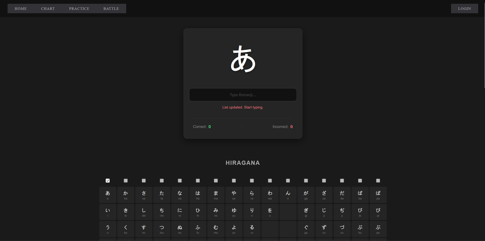
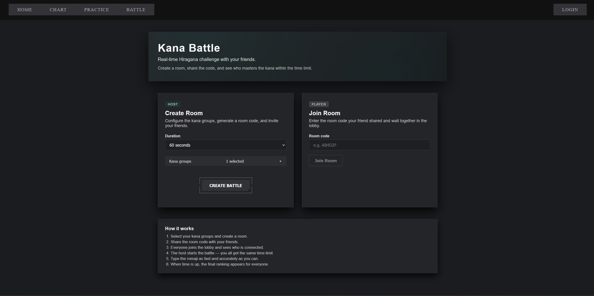
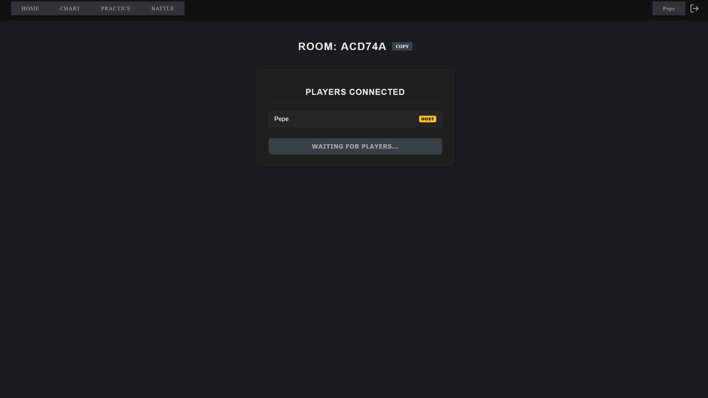
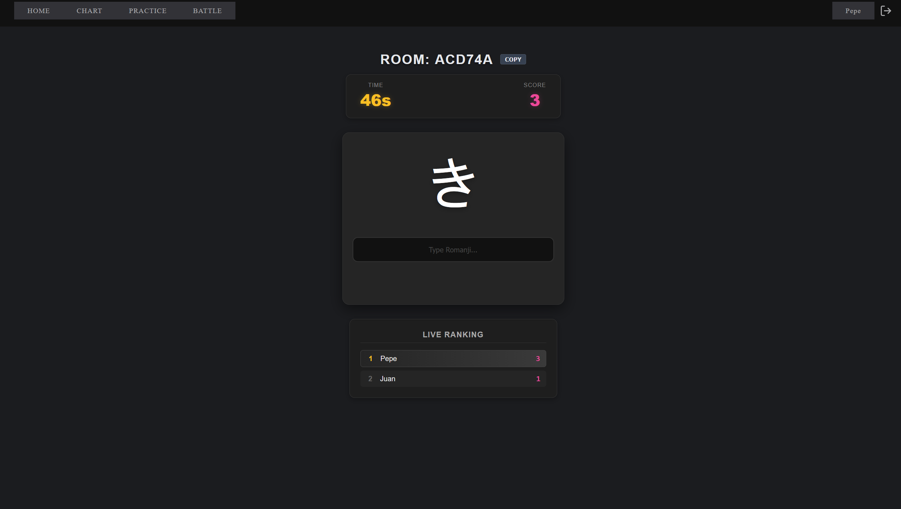

# H a i j i (灰二)

<p align="center">
  
</p>

**Haiji** is a modern web application designed for learning and mastering Japanese Kana (Hiragana & Katakana). It features a competitive "Battle Mode" where users can race against each other to identify characters, powered by real-time WebSockets.

The project is built with a clear separation of concerns, featuring a robust Go backend and a responsive React frontend, orchestrated via Docker.

## Key Features

*   **Learn Kana**: Interactive tables and flashcards for Hiragana and Katakana.
*   **Kana Battle**: Real-time multiplayer competition using WebSockets.
*   **User Profiles**: Manage account details and security settings.
*   **Secure Authentication**: robust JWT integration with HttpOnly cookies and refresh token rotation.

## Tech Stack

### Backend
*   **Language**: Go 1.25
*   **Database**: PostgreSQL 15
*   **Routing**: Standard `net/http` serving decoupled handlers with middleware composition
*   **Data Access**: `sqlc` for type-safe SQL queries
*   **Real-time**: `gorilla/websocket`
*   **Validation**: `go-playground/validator`
*   **Logging**: `log/slog` (Structured Logging)
*   **Migrations**: `pressly/goose`
*   **Security**: Argon2id hashing, JWT, HttpOnly Cookies

### Frontend
*   **Framework**: React 19
*   **Build Tool**: Create React App (react-scripts)
*   **State Management**: React Context API
*   **Styling**: Vanilla CSS (Custom Styles)
*   **Routing**: React Router v6

### Infrastructure
*   **Containerization**: Docker & Docker Compose
*   **Reverse Proxy**: Nginx (serving frontend and proxying API)
*   **Tooling**: `Makefile` for build automation

## Prerequisites

*   [Docker](https://www.docker.com/) and Docker Compose
*   *Optional (for local dev without Docker)*:
    *   Go 1.25+ (Backend)
    *   Node.js 18+ (Frontend)
    *   PostgreSQL 15 (Database)

## Quick Start

The easiest way to run the project is using Docker Compose.

 ### Option 1: Docker (Recommended)
 
 The easiest way. Just run:
 ```bash
 make docker-up
 ```
 This will start the database service, migrate the schema automatically, and launch both backend and frontend.
 
 ### Option 2: Manual Setup (Local Development)
 
 #### 1. Backend & Database
 1.  Ensure you have `go` and `goose` installed.
 2.  Configure your `.env` (copy from `.env.example`).
 3.  Start the database (e.g. `docker-compose up db -d`).
 4.  Run migrations:
     ```bash
     make db-up
     ```
 5.  Run the server:
     ```bash
     make run
     ```
 
 #### 2. Frontend
 1.  Install dependencies:
     ```bash
     make install-frontend
     ```
 2.  Start the development server:
     ```bash
     make run-frontend
     ```
 
 ## Database Migrations
 
 We use `goose` for schema management. Check the `Makefile` for useful commands:
 *   `make db-status`: Check migration status.
 *   `make db-up`: Apply pending migrations.
 *   `make db-down`: Rollback the last migration.
 *   `make db-create`: Create a new SQL migration file.

## Project Structure

```
haiji/
├── backend/                # Go Backend
│   ├── cmd/                # Entrypoint (main.go)
│   ├── internal/           # Private code (Hexagonal-ish structure)
│   │   ├── auth/           # Authentication utilities
│   │   ├── config/         # Environment configuration
│   │   ├── database/       # Generated sqlc code & models
│   │   ├── dto/            # Data Transfer Objects
│   │   ├── game/           # Core Game Logic (WebSocket Hub, Rooms)
│   │   ├── handlers/       # HTTP Handlers (Controllers)
│   │   ├── middleware/     # HTTP Middleware (Auth, CORS, Logging)
│   │   ├── router/         # Router wiring
│   │   └── service/        # Business Logic Services
│   └── sql/                # SQL queries and schemas
├── frontend/               # React Frontend
│   ├── public/             # Static assets
│   └── src/                # Components, Hooks, Context, Pages
├── docker-compose.yml      # Container orchestration
├── Dockerfile.backend      # Production backend build
├── Dockerfile.migrator     # Database migration service
├── Makefile                # Task runner (build, test, migrate)
└── go.mod                  # Go dependencies
```

## Security Features

*   **HttpOnly Cookies**: Refresh tokens are stored securely to prevent XSS attacks.
*   **Rate Limiting**: Login, Refresh, and Room Creation endpoints are rate-limited to prevent brute force and abuse.
*   **Input Validation**: Strict struct validation on all incoming requests using `go-playground/validator`.
*   **Server Hardening**: Configured `http.Server` timeouts to mitigate Slowloris resource exhaustion attacks.
*   **Structured Logging**: JSON logging in production for better observability and security auditing.
*   **Password Hashing**: Industry-standard Argon2id hashing for user passwords.

## Motivation
## Usage
## Contributing
## Screenshots
| | |
|:---:|:---:|
| **Landing Page** | **Kana Chart** |
|  |  |
| *Home page and mode selection* | *Complete Hiragana & Katakana reference* |
| **Practice Mode** | **Battle Landing** |
|  |  |
| *Solo practice session* | *Create or join multiplayer rooms* |
| **Battle Room** | **Kana Battle** |
|  |  |
| *Lobby waiting for players* | *Real-time competitive match* |
